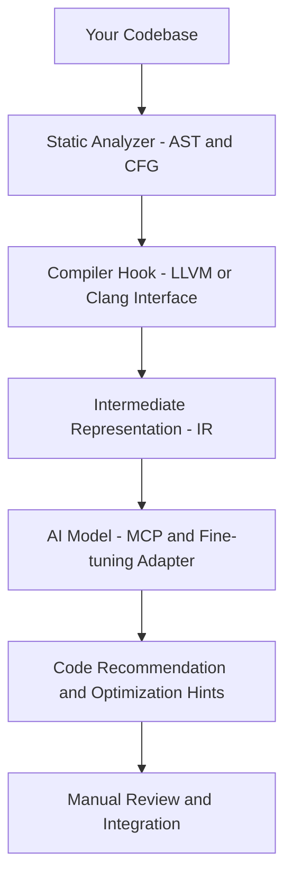

# Tuning for AImodel with LLVM IR

- LLVM IR+AImodel tuning & MCP


- GZIP analytics
```mermaid
flowchart TD

    A[Input Stream] --> B[Sliding Window 32KB]
    B --> C[Match Finder (Longest Match)]
    C -->|Match| D[LZ77 Tokens (len, dist)]
    C -->|Literal| E[Literal Bytes]

    D --> F[Token Stream]
    E --> F

    F --> G[Freq Counter]
    G --> H[Huffman Tree Gen]
    H --> I[Bit Encoder]

    I --> J[CRC32 Gen]
    I --> K[Header Build]
    J --> L[Footer (CRC, Size)]

    K --> M[Output Stream]
    I --> M
    L --> M

    M --> N[Compressed .gz File]
```