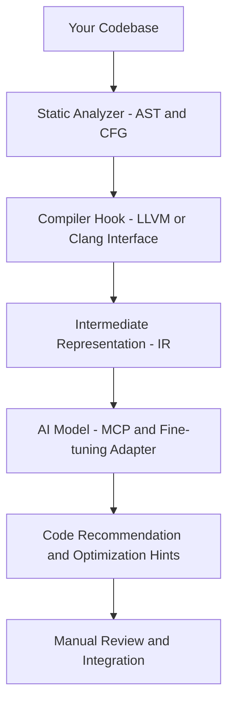

# Tuning for AImodel with LLVM IR

```mermaid
flowchart TD
  A[Your Codebase] --> B[Static Analyzer - AST and CFG]
  B --> C[Compiler Hook - LLVM or Clang Interface]
  C --> D[Intermediate Representation - IR]
  D --> E[AI Model - MCP and Fine-tuning Adapter]
  E --> F[Code Recommendation and Optimization Hints]
  F --> G[Manual Review and Integration]
```