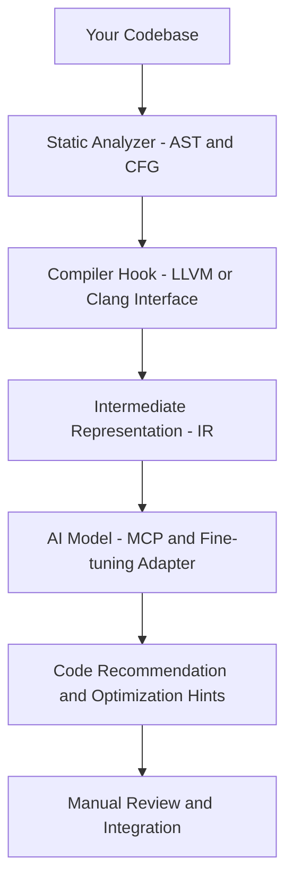

# Tuning for AImodel with LLVM IR

- LLVM IR+AImodel tuning & MCP


- GZIP analytics
```mermaid
flowchart TD

    A[Input Stream] --> B[Sliding Window<br/>32KB Search Buffer]
    B --> C[Match Finder<br/>(Longest Match Search)]
    C -->|Match Found| D[LZ77 Tokens<br/>(<length, distance>)]
    C -->|No Match| E[Literal Bytes]

    D --> F[Token Stream]
    E --> F

    F --> G[Frequency Counter<br/>(Dynamic Huffman)]
    G --> H[Huffman Tree Generator<br/>(Literal/Length & Distance Trees)]
    H --> I[Bit Encoder<br/>(Huffman-coded bitstream)]

    I --> J[CRC32 Generator]
    I --> K[Header Builder<br/>(Magic Bytes / Flags / Timestamps)]
    J --> L[Footer (CRC32 & ISIZE)]

    K --> M[Output Stream]
    I --> M
    L --> M

    M --> N[Compressed File (.gz)]
```